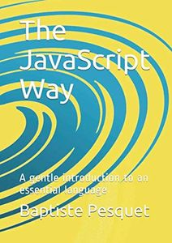

# The JavaScript Way

A gentle introduction to an essential language.

Copyright © 2017-2020 [Baptiste Pesquet](http://bpesquet.fr).

## Overview

This book aims to be a useful companion for anyone wishing to (re)discover the many facets of JavaScript. Numerous brain cycles were spent to make it:

* **Beginner-friendly yet comprehensive**. From the very basics of programming up to front-end and back-end web development, a lot of topics are covered in a simple and accessible way. No prior knowledge needed!
* **Standards-aligned**. The book is entirely written using the recent **ES2015** syntax, giving you future-proof knowledge. From start to finish, it enforces good programming habits, embraces the ubiquitous JavaScript tools [ESLint](http://eslint.org) and [Prettier](https://github.com/prettier/prettier) and closely follows the popular [AirBnb Style Guide](https://github.com/airbnb/javascript).
* **Hands-on**. No real learning happens without practicing! Each chapter is accompanied by a series of exercises to put your newly acquired skills into action. A three-part project will guide you in the creation of a social news web application ([see it in action](https://thejsway-publink.herokuapp.com)).
* **Easy to follow**. Code along directly in your browser or build an efficient JavaScript development environment on your local machine.

## Publishing

This repository contains the book manuscript files, free to read for everyone. Your [contributions](CONTRIBUTING.md) are most welcome.

For a better reading experience, this content is also available:

* As a multi-format, DRM-free eBook on [Leanpub](https://leanpub.com/thejsway), with an option to get the commented source code for all exercises and projects.
* As a paperback book on [Amazon](https://www.amazon.com/dp/2956444611?ref_=pe_3052080_397514860).
* As an interactive online course, including solutions to all exercises, on [Educative](https://www.educative.io/courses/the-complete-javascript-course-build-a-real-world-app-from-scratch).

## Supporting this work

A lot of time and energy went into this content. If you find it useful and want to support this effort, here's what you can do:

* Buy the eBook or paperback version, or take the online course (see above). Any financial contribution would be much appreciated.
* Rate it or leave a review on [Goodreads](https://www.goodreads.com/book/show/35875290-the-javascript-way-a-modern-introduction-to-an-essential-language?from_search=true) or Amazon.
* Spread the word about it.

Thanks in advance for your support!

## Table of contents

* Introduction
  * [About this book](manuscript/intro01.md)
  * [Welcome to programming](manuscript/intro02.md)
  * [Introducing JavaScript](manuscript/intro03.md)
  * [Environment setup](manuscript/intro04.md)
* Part I: Learn to code programs
  * [3, 2, 1... Code!](manuscript/chapter01.md)
  * [Play with variables](manuscript/chapter02.md)
  * [Add conditions](manuscript/chapter03.md)
  * [Repeat statements](manuscript/chapter04.md)
  * [Write functions](manuscript/chapter05.md)
  * [Create your first objects](manuscript/chapter06.md)
  * [Store data in arrays](manuscript/chapter07.md)
  * [Work with strings](manuscript/chapter08.md)
  * [Understand object-oriented programming](manuscript/chapter09.md)
  * [Discover functional programming](manuscript/chapter10.md)
  * [Project: a social news program](manuscript/chapter11.md)
* Part II: Create interactive web pages
  * [What's a web page?](manuscript/chapter12.md)
  * [Discover the DOM](manuscript/chapter13.md)
  * [Traverse the DOM](manuscript/chapter14.md)
  * [Modify page structure](manuscript/chapter15.md)
  * [React to events](manuscript/chapter16.md)
  * [Manipulate forms](manuscript/chapter17.md)
  * [Animate elements](manuscript/chapter18.md)
  * [Project: a social news web page](manuscript/chapter19.md)
* Part III: Build web applications
  * [Web development 101](manuscript/chapter20.md)
  * [Query a web server](manuscript/chapter21.md)
  * [Use web APIs](manuscript/chapter22.md)
  * [Send data to a web server](manuscript/chapter23.md)
  * [Discover Node.js](manuscript/chapter24.md)
  * [Create a web server](manuscript/chapter25.md)
  * [Project: a social news web app](manuscript/chapter26.md)
* Conclusion
  * [Summary and perspectives](manuscript/concl01.md)
  * [Acknowledgements](manuscript/concl02.md)
* Appendices
  * [Style guide](manuscript/appendix02.md)
